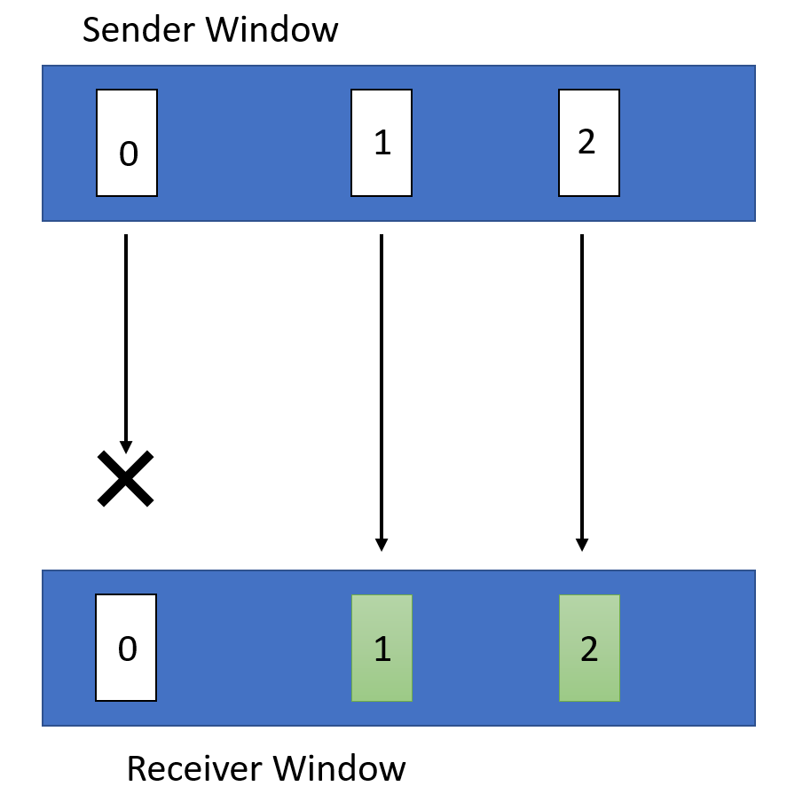

# Assignment 3: Reliable Transport

### Due: November 7, 2025 at 11:59 PM

## Table of contents
* [Overview](#overview)
* [Clarifications](#clarifications)
* [Part 1](#part1): Implement `wSender`
* [Part 2](#part2): Implement `wReceiver`
* [Part 3](#part3): Optimizations
* [Error Handling](#error-handling)
* [Submission Instructions](#submission-instr)
* [Autograder](#autograder)

<a name="overview"></a>
## Overview

In this project, you will build a simple reliable transport protocol, WTP, **on top of UDP**. Your WTP implementation must provide inorder, reliable delivery of UDP datagrams in the presence of events like packet loss, delay, corruption, duplication, and reordering.

There are a variety of ways to ensure a message is reliably delivered from a sender to a receiver. You are to implement a sender (`wSender`) and a receiver (`wReceiver`) that follows the following WTP specification.

### WTP Specification
WTP sends data in the format of a header, followed by a chunk of data.

WTP has four header types: `START`, `END`, `DATA`, and `ACK`, all following the same format:

```
struct PacketHeader {
    unsigned int type;     // 0: START; 1: END; 2: DATA; 3: ACK
    unsigned int seqNum;   // Described below
    unsigned int length;   // Length of data; 0 for ACK, START and END packets
    unsigned int checksum; // 32-bit CRC
}
```

To initiate a connection, `wSender` starts with a `START` message along with a random `seqNum` value, and waits for an ACK for this `START` message. After sending the `START` message, additional packets in the same connection are sent using the `DATA` message type, adjusting `seqNum` appropriately (see below). After everything has been transferred, the connection should be terminated with `wSender` sending an `END` message with the same `seqNumq` as the `START` message, and waiting for the corresponding ACK for this message.

The ACK `seqNum` values for `START` and `END` messages should be set to the `seqNum` values sent by `wSender`.

`wSender` will use **0** as the initial sequence number for data packets in that connection (this is to make debugging easier; a real protocol would probably use the initial sequence number of the start packet + 1). Furthermore, `wReceiver` sends back cumulative `ACK` packets (described in more details below).

### Packet Size
An important limitation is the maximum size of your packets. The UDP protocol has an 8 byte header, and the IP protocol underneath it has a header of 20 bytes. Because we will be using Ethernet networks, which have a maximum frame size of 1500 bytes, this leaves 1472 bytes for your entire `packet` structure (including both the header and the chunk of data).

## Learning Outcomes

After completing this programming assignment, students should be able to:

* Explain the mechanisms required to transfer data reliably
* Describe how different sliding window protocols work

<a name="clarifications"></a>
## Clarifications

* Your program will only be tested with one wSender and one wReceiver for all parts.

<a name="part1"></a>
## Part 1: Implement `wSender`

`wSender` should read an input file and transmit it to a specified receiver using UDP sockets following the WTP protocol. It should split the input file into appropriately sized chunks of data, and append a `checksum` to each packet. `seqNum` should increment by one for each additional packet in a connection. Please use the 32-bit CRC header we provide in the `common` directory, in order to add a checksum to your packet, and only calculate the checksum over the data section of the packet, do not include the packet headers in the checksum calculation.

You will implement reliable transport using a sliding window mechanism. The size of the window (`window-size`) will be specified in the command line. `wSender` must accept cumulative `ACK` packets from `wReceiver`.

After transferring the entire file, you should send an `END` message to mark the end of connection. Note, the `END` message cannot be sent until the full transfer is verified, meaning all `ACK`s from `DATA` packets must have already been received by the sender before sending the `END` message. In addition, because the `END` packet could be dropped, the `END` packet must also be ACKed by the receiver.

`wSender` must ensure reliable data transfer under the following network conditions:

* Loss of arbitrary packets
* Reordering of packets (including ACK messages)
* Duplication of any packets
* Delay in the arrivals of ACKs

To handle cases where `ACK` packets are lost, you should implement a 500 milliseconds retransmission timer to automatically retransmit packets that were never acknowledged.
Whenever the window moves forward (i.e., some ACK(s) are received and some new packets are sent out), you reset the timer. If after 500ms the window still has not advanced, you retransmit all packets in the window because they are all never acknowledged.

### Running `wSender`
`wSender` should be invoked as follows:

`./wSender -h 127.0.0.1 -p 8000 -w 10 -i input.in -o sender.out`

* `-h | --hostname` The IP address of the host that `wReceiver` is running on.
* `-p | --port` The port number on which `wReceiver` is listening.
* `-w | --window-size` Maximum number of outstanding packets in the current window.
* `-i | --input-file` Path to the file that has to be transferred. It can be a text file or binary file (e.g., image or video).
* `-o | --output-log` The file path to which you should log the messages as described above.

*Note: for simplicity, arguments will appear exactly as shown above during testing and grading. Error handling with the arguments is not explicitly tested but is highly recommended. At least printing the correct usage if something went wrong is worthwhile.*

### Logging
`wSender` should create a log of its activity. After sending or receiving each packet, it should append the following line to the log (i.e., everything except the `data` of the `packet` structure described earlier):

`<type> <seqNum> <length> <checksum>`

Do not log received packets if they are dropped (i.e. malformed packets).
You may debug your code using spdlog::debug.

<a name="part2"></a>
## Part 2: Implement `wReceiver`

`wReceiver` needs to handle only one `wSender` at a time and should ignore `START` messages while in the middle of an existing connection. It must receive and store the file sent by the sender on disk completely and correctly; i.e., if it received a video file, we should be able to play it! The stored file should be named `FILE-i.out`, where `i=0` for the file from the first connection, `i=1` for the second, and so on. `wReceiver` should not terminate, so it can handle multiple `wSender` communications in sequence.

`wReceiver` should also calculate the checksum value for the data in each `packet` it receives using the header mentioned in part 1. If the calculated checksum value does not match the `checksum` provided in the header, it should drop the packet (i.e. not send an ACK back to the sender).

For each packet received, it sends a cumulative `ACK` with the `seqNum` it expects to receive next (this includes sending an `ACK` to `END` messages by `wSender`). If it expects a packet of sequence number `N`, the following two scenarios may occur:

1. If it receives a packet with `seqNum` not equal to `N`, it will send back an `ACK` with `seqNum=N`.
2. If it receives a packet with `seqNum=N`, it will check for the highest sequence number (say `M`) of the in­order packets it has already received and send `ACK` with `seqNum=M+1`.

If the next expected `seqNum` is `N`, `wReceiver` will drop all packets with `seqNum` greater than or equal to `N + window-size` to maintain a `window-size` window.

`wReceiver` should also log every single packet it sends and receives using the same format as the `wSender` log. Again, do not log malformed packets that are received and consequently dropped.

### Running `wReceiver`
`wReceiver` should be invoked as follows:

`./wReceiver -p 8000 -w 10 -d /tmp -o receiver.out`

* `-p | --port` The port number on which `wReceiver` is listening for data.
* `-w | --window-size` Maximum number of outstanding packets.
* `-d | --output-dir` The directory that the `wReceiver` will store the output files, i.e the `FILE-i.out` files.
* `-o | --output-log` The file path to which you should log the messages as described above.

*Note: for simplicity, arguments will appear exactly as shown above during testing and grading. Error handling with the arguments is not explicitly tested but is highly recommended. At least printing the correct usage if something went wrong is worthwhile.*

<a name="part3"></a>
## Part 3: Optimizations

For this part of the assignment, you will be making a few modifications to the programs written in the previous two sections. Consider how the programs written in the previous sections would behave for the following case where there is a window of size 3:



In this case `wReceiver` would send back two ACKs both with the sequence number set to 0 (as this is the next packet it is expecting). This will result in a timeout in `wSender` and a retransmission of packets 0, 1 and 2. However, since `wReceiver` has already received and buffered packets 1 and 2. Thus, there is an unnecessary retransmission of these packets.

In order to account for situations like this, you will be modifying your `wReceiver` and `wSender` accordingly. These versions should compile to executables named `wReceiverOpt` and `wSenderOpt`, respectively. 

* `wReceiverOpt` will not send cumulative ACKs anymore; instead, it will send back an ACK with `seqNum` set to whatever it was in the data packet (i.e., if a sender sends a data packet with `seqNum` set to 2, `wReceiver` will also send back an ACK with `seqNum` set to 2). It should still drop all packets with `seqNum` greater than or equal to `N + window_size`, where `N` is the next expected `seqNum`.
* `wSenderOpt` must maintain information about all the ACKs it has received in its current window and maintain an individual timer for each packet. So, for example, packet 0 having a timeout would not necessarily result in a retransmission of packets 1 and 2.

For a more concrete example, here is how your improved `wSenderOpt` and `wReceiverOpt` should behave for the case described at the beginning of this section:


`wReceiverOpt` individually ACKs both packet 1 and 2.


`wSenderOpt` receives these ACKs and denotes in its buffer that packets 1 and 2 have been received. Then, the it waits for the 500 ms timeout and only retransmits packet 0 again.

The command line parameters passed to these new `wSenderOpt` and `wReceiverOpt` are the same as the previous two sections.


<a name="error-handling"></a>
## Error Handling

*`wReceiver`*: The receiver must correctly handle all messages it receives. It must ignore packets from new connections while servicing a connection. It must properly handle duplicate messages (hint: should you ignore duplicate messages or respond to them?). Unlike `wSender`, `wReceiver` does not have any timeout waiting for messages to come back

*`wSender`*: The sender must also correctly handle all messages it receives. It is possible it receives non-ACK messages, and it is possible to receive `ACK` messages whose sequence number might not correspond to an existing packet sent by the sender, or may be a duplicate (which is expected to occur with cumulative ACKs).


<a name="tips"></a>
## Important Notes
* It is up to you how you choose to read from and write to files, but you may find the `std::ifstream.read()` and `std::ofstream.write()` functions particularly helpful.
* Please closely follow updates on Piazza. All further clarifications will be posted on Piazza via pinned Instructor Notes. We recommend you follow these notes to receive updates in time.
* You MUST NOT use TCP sockets.
* You can find an example of UDP socket programming in the Discussion folder.
* Another good resource for UDP socket programming is [Beej's Guide to Network Programming Using Internet Sockets](https://beej.us/guide/bgnet/html/index.html).

<a name="submission-instr"></a>
## Submission Instructions
Submission to the autograder will be done [here](https://g489.eecs.umich.edu/). You will have 3 submissions per day (once the autograder is released).

To submit:
1. Submit all the files that you are using in your code, including any starter code.
2. A base CMake configuration is provided for you. Using it, the autograder should be able to build your solution with the following:
```
mkdir build && cd build
cmake ..
make
./bin/wSender <options>
./bin/wReceiver <options>
./bin/wSenderOpt <options>
./bin/wReceiverOpt <options>
```


    
<a name="autograder"></a>
## Autograder
The autograder will be released within a week of the assignment being released. Each group will have a total of three submits per day. Furthermore, groups have a total of three late days to use across Assignments 2-4. 

The Autograder is not a debugging tool. You can and should design tests to fully test your design.

As in Projects 1 and 2, you will be submitting a tarball to the Autograder. You can create this tarball by running the following command:
```bash
$ bash <path-to-submit-script> <path-to-base-repo>
```
For instance, if your current working directory is the base of the repo, you could run 
```bash
$ bash util/submit.sh .
```
This will create a file called `submit.tar` containing the contents of your `cpp/` folder.  


## Acknowledgements
This programming assignment is based on UC Berkeley's Project 2 from EE 122: Introduction to Communication Networks.
